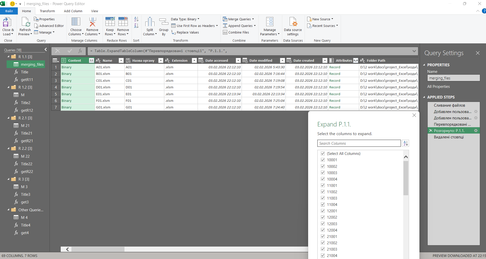
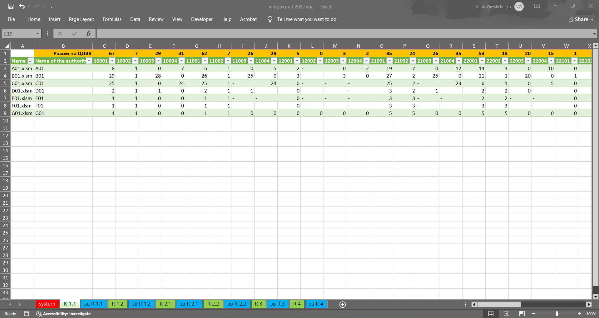

# Excel Power Query Report Decoder

This repository contains an Excel Power Query (M language) solution for processing standardised Excel report templates submitted by multiple organisations.

The solution dynamically loads multiple Excel files from a folder-based source, extracts organisation metadata, and transforms semi-structured report sections into analysis-ready tables suitable for further analysis and reporting.

## Example ETL workflow (R1.1)

### Power Query transformation steps

### Final output preview

## Project structure
- `power_query/functions/` — reusable Power Query (M) functions
- `power_query/sections/` — section-level queries for each report sheet
- `docs/` — project documentation
- `screenshots/` — visual examples of the workflow and outputs

 ## Notes
Sections `R2.1` and `R2.2` follow the same extraction and transformation pattern as other sections and are intentionally omitted from the repository to avoid duplication.

> This project is part of a personal data analytics portfolio.
